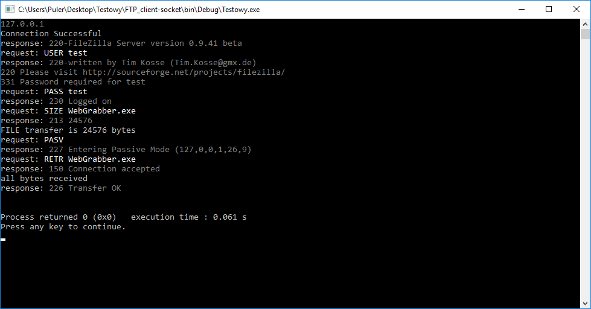

# FTP_client-socket
Prosty moduł pobierający, przeznaczony do auto autoaktualizacji programu

Cross-platform by wiktortr

<h2>Screens</h2>


<h1> Kompilacja w różnych środowiskach</h1>
<ul>

<li>
<h2>Code Block</h2>
<h3>Pamiętaj o linkowaniu biblioteki: <i>ws2_32</i> </h3>

</li>

<li>
<h2>Linux</h2>

```bash
root@home-server:~# apt-get install git g++
root@home-server:~# git clone https://github.com/informacja/FTP_client-socket
root@home-server:~# cd FTP_client-socket
root@home-server:~/FTP_client-socket# make
root@home-server:~/FTP_client-socket# ./main
```
</li>

</ul>
